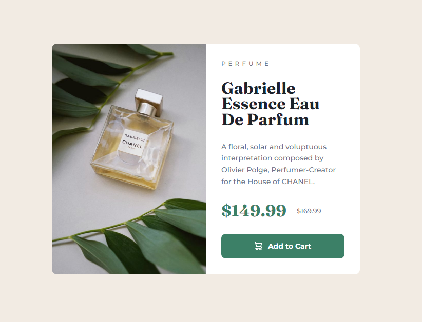
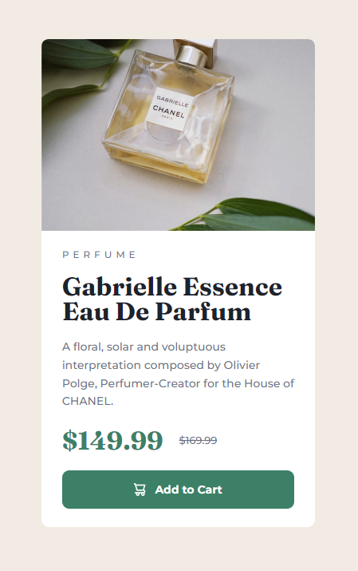

# Frontend Mentor - Product preview card component solution

This is a solution to the [Product preview card component challenge on Frontend Mentor](https://www.frontendmentor.io/challenges/product-preview-card-component-GO7UmttRfa). Frontend Mentor challenges help you improve your coding skills by building realistic projects. 

## Table of contents

- [Overview](#overview)
  - [The challenge](#the-challenge)
  - [Screenshot](#screenshot)
  - [Links](#links)
- [My process](#my-process)
  - [Built with](#built-with)
  - [What I learned](#what-i-learned)
  - [Useful resources](#useful-resources)
- [Author](#author)

## Overview

### The challenge

Users should be able to:

- View the optimal layout depending on their device's screen size
- See hover and focus states for interactive elements

### Screenshot

Desktop view  

Mobile view  


### Links

- Solution URL: [Add solution URL here](https://your-solution-url.com)
- Live Site URL: [https://jcgager.github.io/product-preview-card/](https://jcgager.github.io/product-preview-card/)

## My process

### Built with

- Semantic HTML5 markup
- CSS custom properties
- Flexbox
- Mobile-first workflow
- penpot (open source alternative to Figma) 

### What I learned

On this project, I learned about the picture element and how best to transition from a single column layout for mobile to a two column (side-by-side) layout for larger screens.
<picture>
I have to admit, I got stumped more than once, but this was a great project for me to discover new concepts and now I know how to change images based on the size of the veiwport.

```html
<picture>
  <source srcset="./images/image-product-mobile.jpg" media="(max-width: 650px)">
  <source srcset="./images/image-product-desktop.jpg">
  
</picture>
```
I also learned (the hard way) that the "img" is what you callout in css for styling, not the "picture".

For this project, I learned the basics of [penpot](https://penpot.app/) to first create the components in a designing platform
so I would have better control over scaling each element. 


### Useful resources

- [Master Responsive Images by CodeLab](https://www.youtube.com/watch?v=6EJVYwichvs&t=1304s) - This helped me understand some best practices on working with images in a responsive manner. 

## Author

- Frontend Mentor - [@jcgager](https://www.frontendmentor.io/profile/jcgager)
- Twitter - [@Soul3raser](https://www.twitter.com/Soul3raser)
